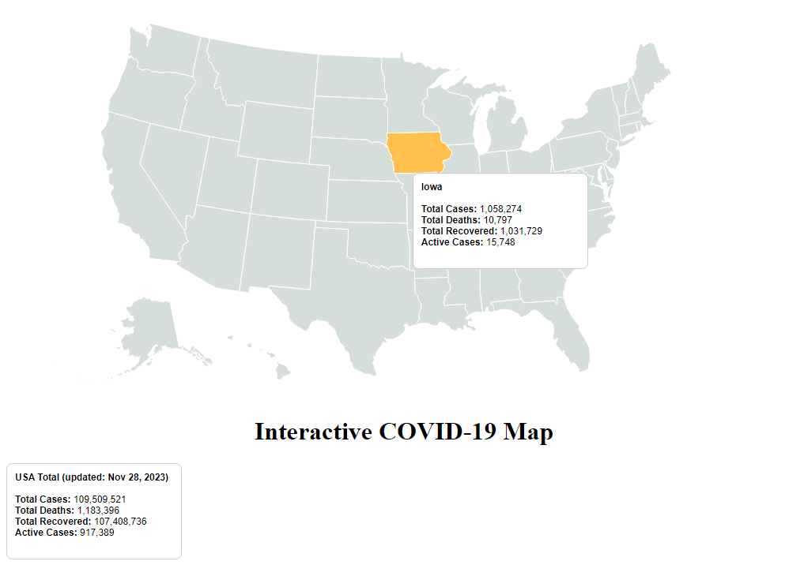

<a name="readme-top"></a>


<!-- ABOUT THE PROJECT -->
## About The Project

[](DataVis/output,png)


## How to Run

Navigate to repository where the code is located.
* Run this command in the terminal:
  ```sh
  python -m http.server
  ```
* Open your preferred browser and run:
  ```sh
  localhost:8000
  ```


## Team Members

Tommy Garriga - [Contact](tommygarriga@tamu.edu)

Jonathan Kutsch - [Contact](jonathankutsch@tamu.edu)

Trey Smith - [Contact](totreysmith@tamu.edu)

Vincent LoBello - [Contact](vlobello@tamu.edu)

Fisher Byers - [Contact](fisherbyers@tamu.edu)

Project Link: [Team GitHub](https://github.com/TreeSmith23/DataVis)


## Resources

* [COVID-19 Data](https://www.worldometers.info/coronavirus/country/us/)
* [Learn GitHub](https://docs.github.com/get-started)
* [Learn D3.js](https://d3js.org/)

<p align="right">(<a href="#readme-top">back to top</a>)</p>